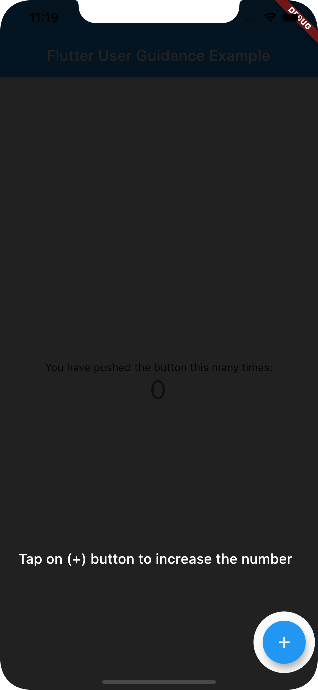

# flutter_user_guidance

An example of user guidance in Flutter.

[https://medium.com/litslink/flutter-interactive-user-guidanc-e-or-how-to-make-a-hole-in-layout-d72bf6eb27f9](https://medium.com/litslink/flutter-interactive-user-guidanc-e-or-how-to-make-a-hole-in-layout-d72bf6eb27f9)

## Demo

